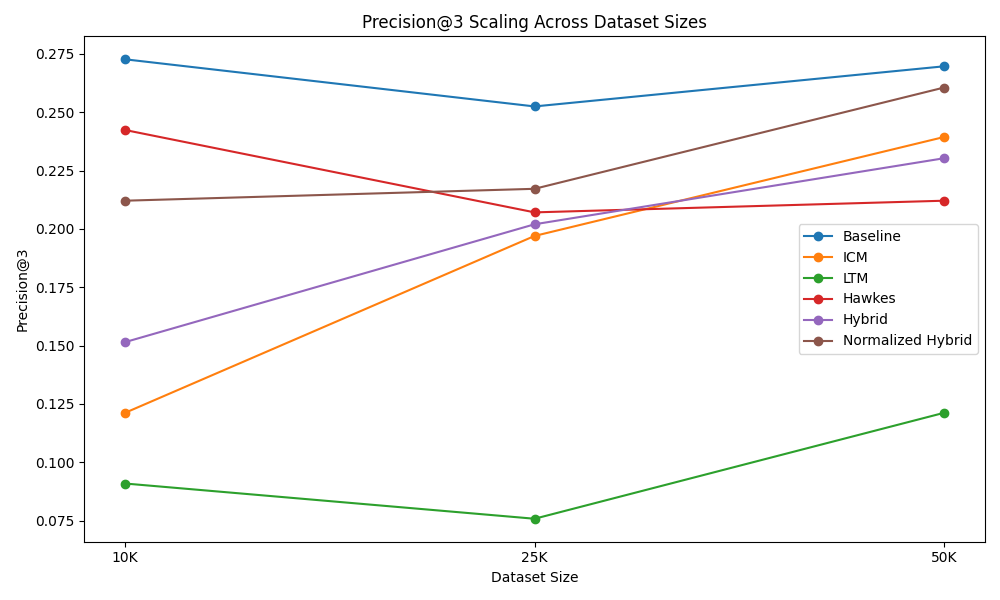
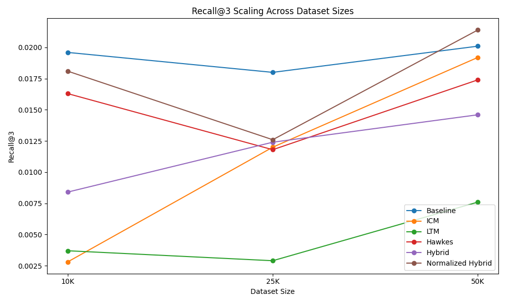
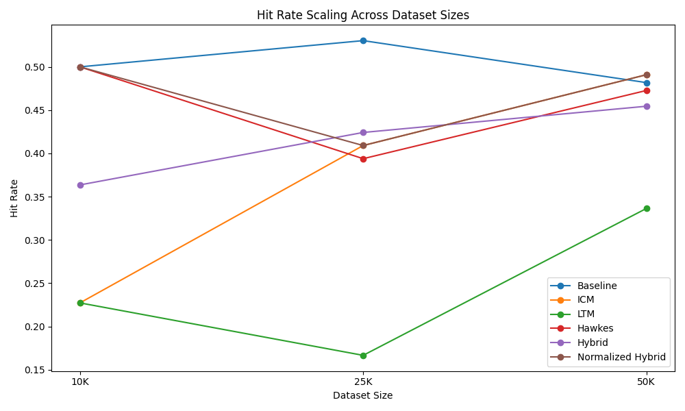
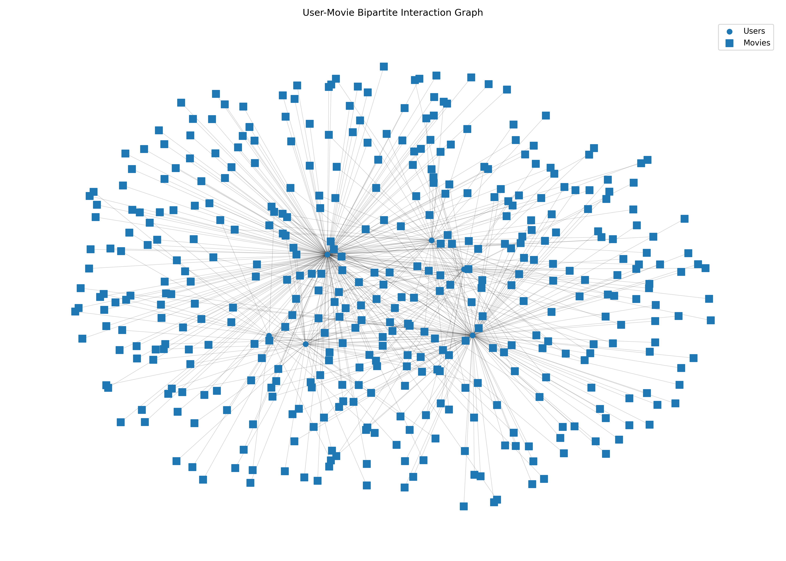
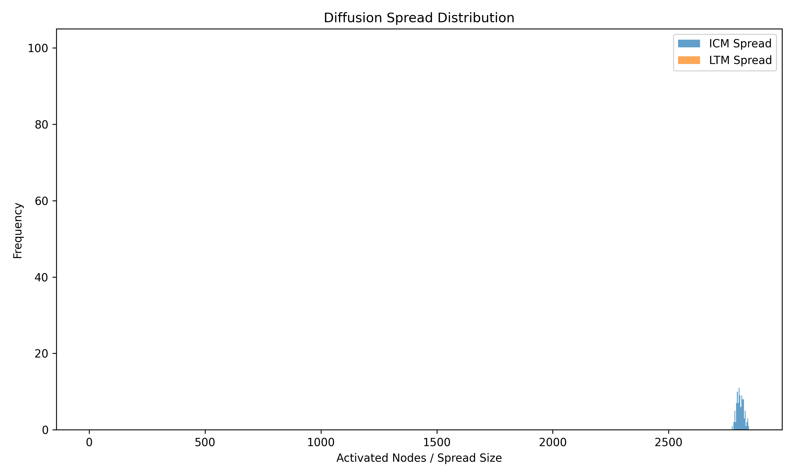
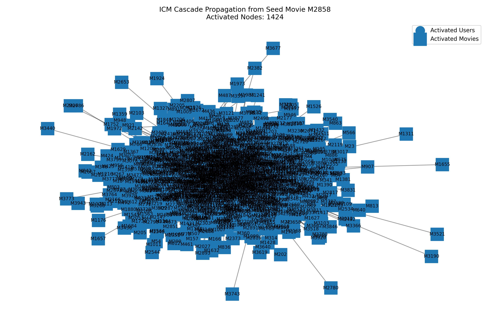
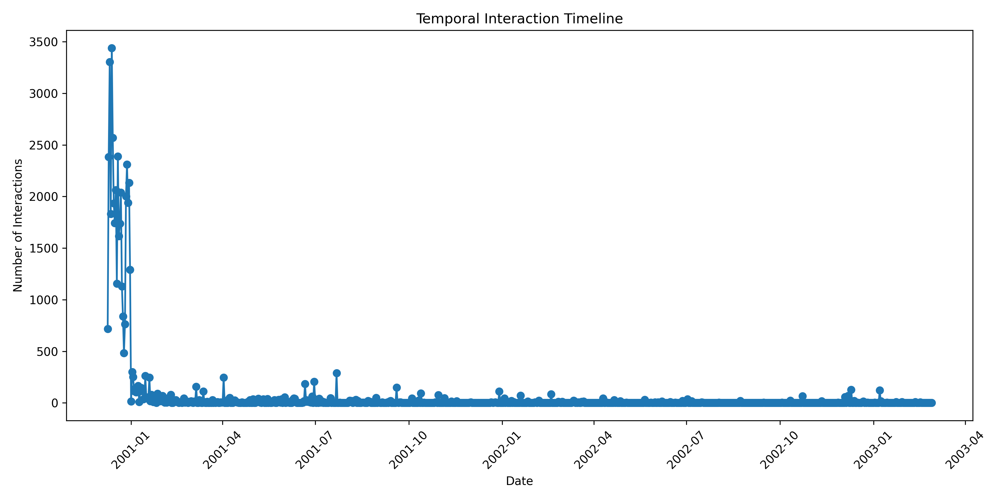
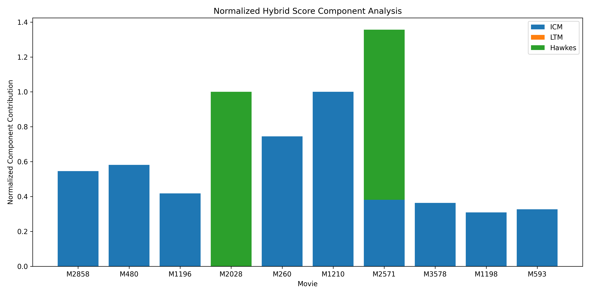

# Hybrid Cascade-Aware Recommendation Framework  
### Using Independent Cascade, Linear Threshold, and Hawkes-Based Temporal Diffusion Features


---

# Overview

This repository presents a **Hybrid Cascade-Aware Recommendation Framework** that integrates:

- Independent Cascade Model (ICM)
- Linear Threshold Model (LTM)
- Hawkes Process-based Temporal Diffusion

to model recommendation systems as **dynamic information diffusion processes** operating over graph-based interaction networks.

Unlike traditional recommendation systems that rely primarily on static similarity estimation and collaborative filtering, this framework incorporates:

- probabilistic influence propagation,
- neighborhood activation dynamics,
- temporal interaction intensity,
- structural virality,
- and cascade-aware recommendation modeling.

The framework combines concepts from:

- Recommendation Systems
- Network Science
- Information Diffusion
- Temporal Point Processes
- Graph Analytics
- Social Recommendation
- Cascade Prediction

---

# Research Motivation

Modern recommendation systems operate in highly dynamic environments where:

- user behavior evolves continuously,
- recommendations influence future interactions,
- and recommendation exposure propagates across interconnected networks.

Traditional collaborative filtering approaches often fail to model:

- influence spread,
- temporal recommendation dynamics,
- cascade propagation,
- and recommendation dissemination behavior.

This project introduces a hybrid diffusion-aware recommendation framework capable of modeling:

- structural recommendation propagation,
- temporal recommendation evolution,
- and diffusion-aware personalization.

---

# Proposed Framework

The framework integrates three major diffusion paradigms:

| Component | Purpose |
|---|---|
| Independent Cascade Model (ICM) | Probabilistic influence propagation |
| Linear Threshold Model (LTM) | Collective neighborhood activation |
| Hawkes Process | Temporal self-exciting recommendation dynamics |

The final recommendation score is computed using weighted hybrid fusion:

```math
S_{hybrid}=w_1S_{ICM}+w_2S_{LTM}+w_3S_{Hawkes}
```

---

# System Architecture

```text
User-Item Interactions
        ↓
Graph Construction
        ↓
ICM Diffusion
        ↓
LTM Influence Modeling
        ↓
Hawkes Temporal Intensity
        ↓
Hybrid Score Fusion
        ↓
Top-K Recommendations
```

---

# Repository Structure

```text
Hybrid-Cascade-Aware-Recommendation-Framework/
│
├── paper/
├── src/
├── data/
├── outputs/
├── requirements.txt
├── README.md
└── LICENSE
```

---

# Dataset Description

## 1. Synthetic Dataset

A synthetic briefs interaction dataset was initially generated to validate:

- graph construction,
- cascade simulation,
- diffusion propagation,
- and hybrid recommendation logic.

The synthetic dataset contained:

- Users
- Briefs
- Interaction Records
- Temporal Timestamps

This dataset was used only for initial framework testing.

---

## 2. MovieLens Dataset

Final experiments were conducted using the MovieLens recommendation dataset.

### Why MovieLens?

MovieLens was selected because:

- it is a standard benchmark recommendation dataset,
- contains realistic user-item interactions,
- supports sparse recommendation analysis,
- and includes temporal interaction information.

### Preprocessing Pipeline

The original `.dat` files were converted into CSV format:

- ratings.dat → interactions.csv
- movies.dat → movies.csv
- users.dat → users.csv

The processed interactions were transformed into graph structures for diffusion simulation and recommendation analysis.

---

# Graph Construction

User-item interactions were modeled as a bipartite graph:

```math
G = (U, I, E)
```

where:

- \(U\) = users
- \(I\) = items
- \(E\) = interaction edges

Weighted edges represented:

- interaction frequency,
- temporal activity,
- and recommendation exposure strength.

---

# Diffusion Models

## Independent Cascade Model (ICM)

The Independent Cascade Model simulates probabilistic recommendation propagation.

```math
P(v \text{ activated}) =
1 - \prod_{u \in N(v)} (1 - p_{uv})
```

### Captures:
- influence spread
- cascade propagation
- viral recommendation behavior

---

## Linear Threshold Model (LTM)

The Linear Threshold Model captures collective neighborhood influence.

```math
\sum_{u \in N(v)} w_{uv} \geq \theta_v
```

### Captures:
- social reinforcement
- neighborhood activation
- community influence

---

## Hawkes Process

Temporal recommendation intensity is modeled using Hawkes Processes.

<p align="center">

$\lambda(t)=\mu+\sum_{t_i<t}\alpha e^{-\beta(t-t_i)}$

</p>

### Captures:
- temporal recommendation dynamics
- recency effects
- self-exciting interaction behavior

---

# Experimental Evaluation

The framework was evaluated using:

- Precision@3
- Recall@3
- Hit Rate
- Cascade Size
- Structural Virality
- Diffusion Spread Analysis
- Temporal Interaction Dynamics

---

# Recommendation Performance

## Precision@3 Scaling



The baseline model achieved the highest precision overall, while the normalized hybrid framework demonstrated competitive and stable performance under larger interaction settings.

---

## Recall@3 Scaling



The normalized hybrid framework demonstrated improved recall under larger datasets, suggesting better recommendation coverage.

---

## Hit Rate Scaling



The baseline and normalized hybrid approaches maintained stable performance across varying dataset sizes.

---

# Diffusion Analysis

## User-Movie Bipartite Interaction Graph



The interaction graph models users and movies as separate node types connected through recommendation interaction edges.

---

## Diffusion Spread Distribution



The Independent Cascade Model generated broader propagation spread, while the Linear Threshold Model produced more constrained activation behavior.

---

## ICM Cascade Propagation



Cascade propagation visualization from a seed movie node using Independent Cascade diffusion.

Activated Nodes: **1424**

---

# Temporal Interaction Analysis

## Temporal Interaction Timeline



The Hawkes Process component captured strong temporal interaction bursts and recency-sensitive recommendation behavior.

---

# Hybrid Component Analysis

## Normalized Hybrid Score Components



The hybrid recommendation framework combines:

- structural propagation,
- neighborhood influence,
- and temporal interaction intensity.

---

# Example Recommendation Outputs

## Example User Recommendations

### User: U1

Previously Watched Movies:
- One Flew Over the Cuckoo's Nest
- Erin Brockovich
- Princess Bride
- Wizard of Oz

Top Recommendations:
1. Bicycle Thief
2. West Beirut
3. Jurassic Park
4. Aliens
5. Alien

### Interpretation

| Component | Meaning |
|---|---|
| High ICM | Strong cascade propagation |
| High LTM | Strong neighborhood influence |
| High Hawkes | Strong temporal interaction intensity |

---

# Key Findings

The experiments demonstrated that:

- diffusion-aware recommendation systems provide richer propagation analysis,
- ICM improves recommendation diversity,
- Hawkes Processes improve temporal adaptability,
- hybrid diffusion integration improves interpretability,
- and graph-based recommendation modeling improves recommendation explainability.

---

# Limitations

Current limitations include:

- synthetic data simplifications,
- scalability challenges,
- parameter sensitivity,
- sparse interaction behavior,
- and simplified diffusion assumptions.

---

# Future Work

Future extensions may include:

- Graph Neural Networks (GNNs)
- Reinforcement Learning
- Dynamic Graph Learning
- Real-world Social Network Datasets
- LLM-enhanced Recommendation Systems

---

# Installation

## Clone Repository

```bash
git clone https://github.com/yourusername/Hybrid-Cascade-Aware-Recommendation-Framework.git

cd Hybrid-Cascade-Aware-Recommendation-Framework
```

---

## Install Dependencies

```bash
pip install -r requirements.txt
```

---

# Running Experiments

## Generate Synthetic Dataset

```bash
python src/generate_synthetic_data.py
```

---

## Run Recommendation Pipeline

```bash
python src/run_recommendations.py
```

---

## Compare Models

```bash
python src/compare_models.py
```

---

## Visualize Diffusion Graphs

```bash
python src/visualize_graph.py
```

---

# Citation

If you use this work, please cite:

```bibtex
@article{mahanawar2026hybrid,
  title={A Hybrid Cascade-Aware Recommendation Framework Using Independent Cascade, Linear Threshold, and Hawkes-Based Temporal Diffusion Features},
  author={Mahanawar, Prajwal},
  year={2026},
  note={Preprint}
}
```

---

# Author

## Prajwal Mahanawar

MSc Data Science & Statistical Learning  
University of Limerick

Research Interests:
- Information Diffusion
- Recommendation Systems
- Network Science
- Temporal Point Processes
- Graph-Based Machine Learning
- AI-driven Recommendation Systems

---

# License

This project is licensed under the MIT License.
